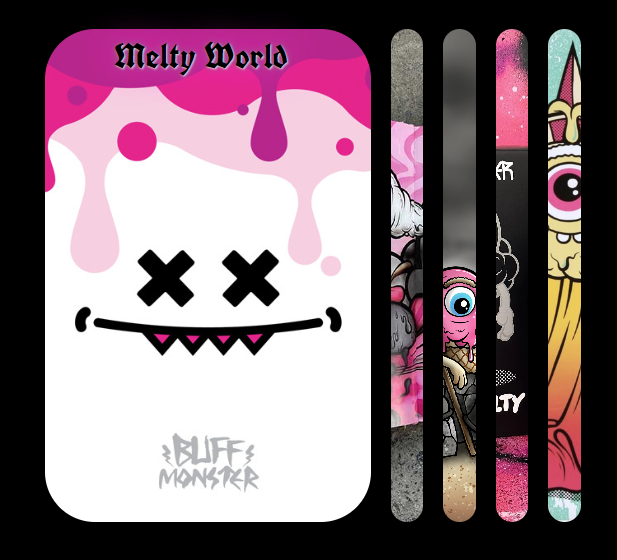
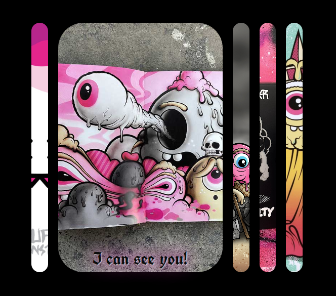
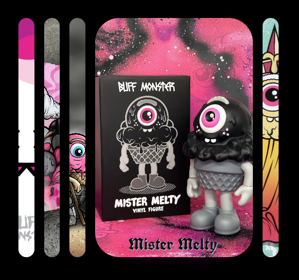

# Expanding-Cards (50 Projects In 50 Days - HTML, CSS & JavaScript)

* [1. Resumen del proyecto](#1-resumen-del-proyecto)
* [2. Investigación UX](#2-investigación-ux)
* [3. Herramientas implementadas](#3-herramientas-implementadas)
* [4. Vista 1 ](#4-vista-1)
* [5. Vista 2 ](#5-vista-2)
* [6. Vista 3 ](#6-vista-3)

***

## 1. Resumen del proyecto
El objetivo de este proyecto parte de la necesidad de practicar mis hablidades en el Front-End (basándome en 50 Projects In 50 Days) con la finalidad de mejorar la manipulación del Dom, eventos, arreglos, estilos, transiciones, etc.
 
La temática de este pequeño proyecto consiste en mostrar tarjetas expandibles, cada panel incluye su propia imagen de fondo, al momento de que el usuario de click en alguna imagen, esta se expandirá y se mostrará la imagen completa así como su nombre; en consecuencia el tamaño de las demás se reducirá.

## 2. Investigación UX

Expanding-Cards está dirigido a personas interesadas en el arte de Buff Monster.

## 3. Herramientas Implementadas

CSS, HTML y JAVASCRIPT.

## 4. Vista 1

## 5. Vista 2

## 6. Vista 3

